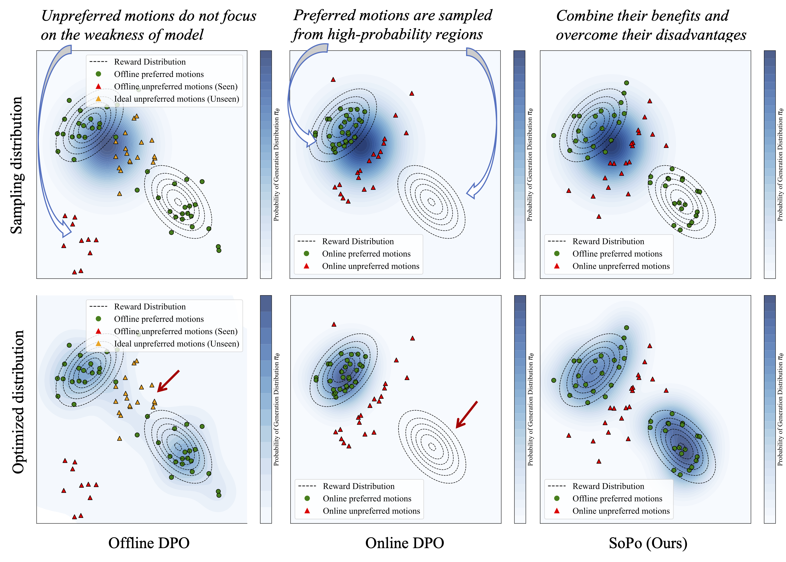

<h1 align="center"><strong>SoPo: Text-to-Motion Generation Using Semi-Online Preference Optimization
</strong></h1>
  <p align="center">
      <strong><span style="color: red;">NeurIPS 2025</span></strong>
    <br>
   <a href='https://xiaofeng-tan.github.io/' target='_blank'>Xiaofeng Tan<sup>1,2</sup></a>&emsp;
   Hongsong Wang*<sup>1,2</sup>&emsp;
   Xin Geng<sup>1,2</sup>&emsp;
   Pan Zhou<sup>3</sup>&emsp;
    <br>
    <sup>1</sup>Southeast University&emsp;
    <sup>2</sup>PALM Lab &emsp;
    <sup>2</sup>Singapore Management University     
    <br>
    *Indicates Corresponding Author
  </p>
</p>

<p align="center">
  <a href='https://arxiv.org/abs/2412.05095'>
    </a>
  <a href='https://xiaofeng-tan.github.io/projects/SoPo/'>
    </a>
</p>

</div>

<p>
    How effectively can 
    <span style="color: #84193E; font-weight: bold;">discriminative </span>
    model improve motion
    <span style="color: #84193E; font-weight: bold;"> generation </span> quality
    <span style="color: #84193E; font-weight: bold;">without any inference cost</span>?
</p>


<p style="font-size: 1.0em; line-height: 1.6; border-left: 5px solid #007BFF; padding-left: 15px; background-color: #f7f9fc;">
    <span style="font-weight: bold; color: #007BFF;">TL;DR:</span>
    We propose <span style="font-weight: 900; color: #004D99; background-color: #DDEEFF; padding: 2px 4px; border-radius: 3px;">SoPo</span>, a semi-online preference optimization method, combining the strengths of online and offline direct preference optimization to overcome their individual shortcomings, delivering enhanced motion generation quality and preference alignment.
</p>

<div align="center">
    
</div>

## 📣 News
- **[2025/09]** SoPo has been officially accepted by *NeurIPS 2025*! 🎉
- **[2024/12]** The paper has been publicly released.

## 📆 Plan
- [x] Release early version.
- [ ] Release final version.
- [ ] Release code for T2M: 
  - [x] Release environment guidance.
  - [ ] Release evaluation code.
  - [ ] Release inference code.
  - [ ] Release training code.
  - [ ] Release checkpoints.
- [ ] Release code for T2I.
- [ ] Release extended version.

## Setup

### 1. Setup environment

Install ffmpeg (if not already installed):

```shell
sudo apt update
sudo apt install ffmpeg
```

Setup conda env:
```shell
conda env create -f environment.yml
conda activate mdm
python -m spacy download en_core_web_sm
pip install git+https://github.com/openai/CLIP.git
```

Download dependencies:

```bash
bash prepare/download_smpl_files.sh
bash prepare/download_glove.sh
bash prepare/download_t2m_evaluators.sh
```

### 2. Get data

**HumanML3D** - Follow the instructions in [HumanML3D](https://github.com/EricGuo5513/HumanML3D.git),
then copy the result dataset to our repository:

```shell
cp -r ../HumanML3D/HumanML3D ./dataset/HumanML3D
```

**KIT** - Download from [Here](https://github.com/EricGuo5513/HumanML3D.git) (no processing needed this time) and the place result in `./dataset/KIT-ML`
</details>

### 3. Download the pretrained models

Download the model(s) you wish to use, then unzip and place them in `./save/`. 

[NEW!] [humanml_trans_dec_512_bert-50steps](https://drive.google.com/file/d/1z5IW5Qa9u9UdkckKylkcSXCwIYgLPhIC/view?usp=sharing) - Runs 20X faster with improved precision!

### 4. Setup TMR


## Acknowledgement

This work is built on many amazing research works and open-source projects, thanks a lot to all the authors for sharing!

- https://github.com/GuyTevet/motion-diffusion-model
- https://github.com/ChenFengYe/motion-latent-diffusion
- https://github.com/Dai-Wenxun/MotionLCM

## Citation
If you find this repository/work helpful in your research, please consider citing the paper and starring the repo ⭐.

```
@article{tan2025sopo,
  title={SoPo: Text-to-Motion Generation Using Semi-Online Preference Optimization},
  author={Tan, Xiaofeng and Wang, Hongsong and Geng, Xin and Zhou, Pan},
  journal={Advances in Neural Information Processing Systems},
  year={2025}
}
```
